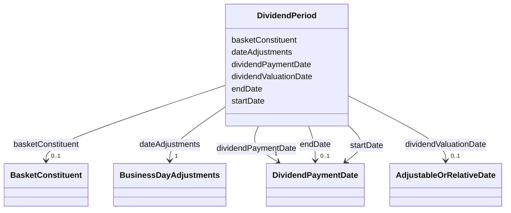

```mermaid
 classDiagram
    class DividendPeriod
    click DividendPeriod href "../DividendPeriod"
      DividendPeriod : basketConstituent
        
          
    
        
        
        DividendPeriod --> "0..1" BasketConstituent : basketConstituent
        click BasketConstituent href "../BasketConstituent"
    

        
      DividendPeriod : dateAdjustments
        
          
    
        
        
        DividendPeriod --> "1" BusinessDayAdjustments : dateAdjustments
        click BusinessDayAdjustments href "../BusinessDayAdjustments"
    

        
      DividendPeriod : dividendPaymentDate
        
          
    
        
        
        DividendPeriod --> "1" DividendPaymentDate : dividendPaymentDate
        click DividendPaymentDate href "../DividendPaymentDate"
    

        
      DividendPeriod : dividendValuationDate
        
          
    
        
        
        DividendPeriod --> "0..1" AdjustableOrRelativeDate : dividendValuationDate
        click AdjustableOrRelativeDate href "../AdjustableOrRelativeDate"
    

        
      DividendPeriod : endDate
        
          
    
        
        
        DividendPeriod --> "0..1" DividendPaymentDate : endDate
        click DividendPaymentDate href "../DividendPaymentDate"
    

        
      DividendPeriod : startDate
        
          
    
        
        
        DividendPeriod --> "0..1" DividendPaymentDate : startDate
        click DividendPaymentDate href "../DividendPaymentDate"
    

        
      
```
