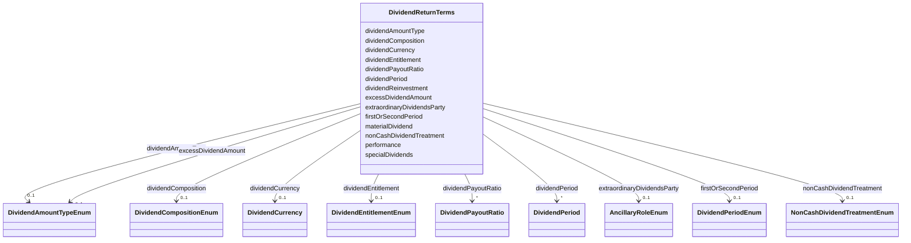

```mermaid
 classDiagram
    class DividendReturnTerms
    click DividendReturnTerms href "../DividendReturnTerms"
      DividendReturnTerms : dividendAmountType
        
          
    
        
        
        DividendReturnTerms --> "0..1" DividendAmountTypeEnum : dividendAmountType
        click DividendAmountTypeEnum href "../DividendAmountTypeEnum"
    

        
      DividendReturnTerms : dividendComposition
        
          
    
        
        
        DividendReturnTerms --> "0..1" DividendCompositionEnum : dividendComposition
        click DividendCompositionEnum href "../DividendCompositionEnum"
    

        
      DividendReturnTerms : dividendCurrency
        
          
    
        
        
        DividendReturnTerms --> "0..1" DividendCurrency : dividendCurrency
        click DividendCurrency href "../DividendCurrency"
    

        
      DividendReturnTerms : dividendEntitlement
        
          
    
        
        
        DividendReturnTerms --> "0..1" DividendEntitlementEnum : dividendEntitlement
        click DividendEntitlementEnum href "../DividendEntitlementEnum"
    

        
      DividendReturnTerms : dividendPayoutRatio
        
          
    
        
        
        DividendReturnTerms --> "*" DividendPayoutRatio : dividendPayoutRatio
        click DividendPayoutRatio href "../DividendPayoutRatio"
    

        
      DividendReturnTerms : dividendPeriod
        
          
    
        
        
        DividendReturnTerms --> "*" DividendPeriod : dividendPeriod
        click DividendPeriod href "../DividendPeriod"
    

        
      DividendReturnTerms : dividendReinvestment
        
      DividendReturnTerms : excessDividendAmount
        
          
    
        
        
        DividendReturnTerms --> "0..1" DividendAmountTypeEnum : excessDividendAmount
        click DividendAmountTypeEnum href "../DividendAmountTypeEnum"
    

        
      DividendReturnTerms : extraordinaryDividendsParty
        
          
    
        
        
        DividendReturnTerms --> "0..1" AncillaryRoleEnum : extraordinaryDividendsParty
        click AncillaryRoleEnum href "../AncillaryRoleEnum"
    

        
      DividendReturnTerms : firstOrSecondPeriod
        
          
    
        
        
        DividendReturnTerms --> "0..1" DividendPeriodEnum : firstOrSecondPeriod
        click DividendPeriodEnum href "../DividendPeriodEnum"
    

        
      DividendReturnTerms : materialDividend
        
      DividendReturnTerms : nonCashDividendTreatment
        
          
    
        
        
        DividendReturnTerms --> "0..1" NonCashDividendTreatmentEnum : nonCashDividendTreatment
        click NonCashDividendTreatmentEnum href "../NonCashDividendTreatmentEnum"
    

        
      DividendReturnTerms : performance
        
      DividendReturnTerms : specialDividends
        
      
```
