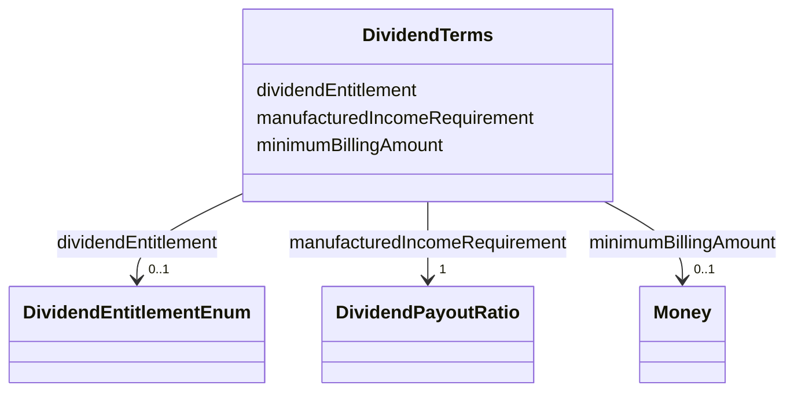

```mermaid
 classDiagram
    class DividendTerms
    click DividendTerms href "../DividendTerms"
      DividendTerms : dividendEntitlement
        
          
    
        
        
        DividendTerms --> "0..1" DividendEntitlementEnum : dividendEntitlement
        click DividendEntitlementEnum href "../DividendEntitlementEnum"
    

        
      DividendTerms : manufacturedIncomeRequirement
        
          
    
        
        
        DividendTerms --> "1" DividendPayoutRatio : manufacturedIncomeRequirement
        click DividendPayoutRatio href "../DividendPayoutRatio"
    

        
      DividendTerms : minimumBillingAmount
        
          
    
        
        
        DividendTerms --> "0..1" Money : minimumBillingAmount
        click Money href "../Money"
    

        
      
```
