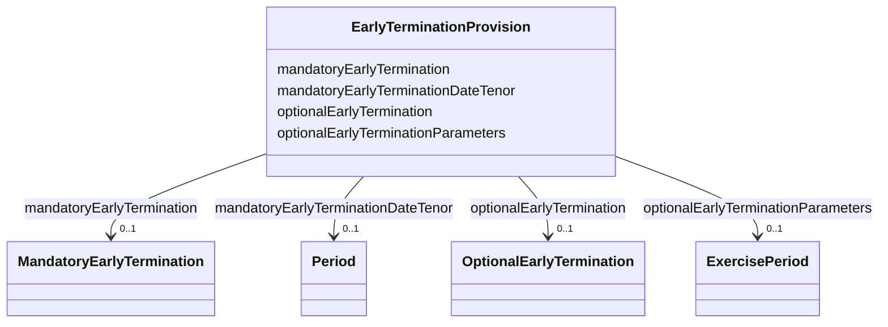

```mermaid
 classDiagram
    class EarlyTerminationProvision
    click EarlyTerminationProvision href "../EarlyTerminationProvision"
      EarlyTerminationProvision : mandatoryEarlyTermination
        
          
    
        
        
        EarlyTerminationProvision --> "0..1" MandatoryEarlyTermination : mandatoryEarlyTermination
        click MandatoryEarlyTermination href "../MandatoryEarlyTermination"
    

        
      EarlyTerminationProvision : mandatoryEarlyTerminationDateTenor
        
          
    
        
        
        EarlyTerminationProvision --> "0..1" Period : mandatoryEarlyTerminationDateTenor
        click Period href "../Period"
    

        
      EarlyTerminationProvision : optionalEarlyTermination
        
          
    
        
        
        EarlyTerminationProvision --> "0..1" OptionalEarlyTermination : optionalEarlyTermination
        click OptionalEarlyTermination href "../OptionalEarlyTermination"
    

        
      EarlyTerminationProvision : optionalEarlyTerminationParameters
        
          
    
        
        
        EarlyTerminationProvision --> "0..1" ExercisePeriod : optionalEarlyTerminationParameters
        click ExercisePeriod href "../ExercisePeriod"
    

        
      
```
