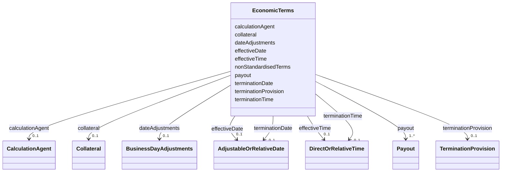

```mermaid
 classDiagram
    class EconomicTerms
    click EconomicTerms href "../EconomicTerms"
      EconomicTerms : calculationAgent
        
          
    
        
        
        EconomicTerms --> "0..1" CalculationAgent : calculationAgent
        click CalculationAgent href "../CalculationAgent"
    

        
      EconomicTerms : collateral
        
          
    
        
        
        EconomicTerms --> "0..1" Collateral : collateral
        click Collateral href "../Collateral"
    

        
      EconomicTerms : dateAdjustments
        
          
    
        
        
        EconomicTerms --> "0..1" BusinessDayAdjustments : dateAdjustments
        click BusinessDayAdjustments href "../BusinessDayAdjustments"
    

        
      EconomicTerms : effectiveDate
        
          
    
        
        
        EconomicTerms --> "0..1" AdjustableOrRelativeDate : effectiveDate
        click AdjustableOrRelativeDate href "../AdjustableOrRelativeDate"
    

        
      EconomicTerms : effectiveTime
        
          
    
        
        
        EconomicTerms --> "0..1" DirectOrRelativeTime : effectiveTime
        click DirectOrRelativeTime href "../DirectOrRelativeTime"
    

        
      EconomicTerms : nonStandardisedTerms
        
      EconomicTerms : payout
        
          
    
        
        
        EconomicTerms --> "1..*" Payout : payout
        click Payout href "../Payout"
    

        
      EconomicTerms : terminationDate
        
          
    
        
        
        EconomicTerms --> "0..1" AdjustableOrRelativeDate : terminationDate
        click AdjustableOrRelativeDate href "../AdjustableOrRelativeDate"
    

        
      EconomicTerms : terminationProvision
        
          
    
        
        
        EconomicTerms --> "0..1" TerminationProvision : terminationProvision
        click TerminationProvision href "../TerminationProvision"
    

        
      EconomicTerms : terminationTime
        
          
    
        
        
        EconomicTerms --> "0..1" DirectOrRelativeTime : terminationTime
        click DirectOrRelativeTime href "../DirectOrRelativeTime"
    

        
      
```
