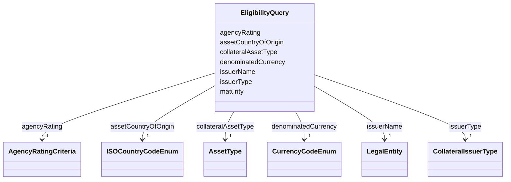

```mermaid
 classDiagram
    class EligibilityQuery
    click EligibilityQuery href "../EligibilityQuery"
      EligibilityQuery : agencyRating
        
          
    
        
        
        EligibilityQuery --> "1" AgencyRatingCriteria : agencyRating
        click AgencyRatingCriteria href "../AgencyRatingCriteria"
    

        
      EligibilityQuery : assetCountryOfOrigin
        
          
    
        
        
        EligibilityQuery --> "1" ISOCountryCodeEnum : assetCountryOfOrigin
        click ISOCountryCodeEnum href "../ISOCountryCodeEnum"
    

        
      EligibilityQuery : collateralAssetType
        
          
    
        
        
        EligibilityQuery --> "1" AssetType : collateralAssetType
        click AssetType href "../AssetType"
    

        
      EligibilityQuery : denominatedCurrency
        
          
    
        
        
        EligibilityQuery --> "1" CurrencyCodeEnum : denominatedCurrency
        click CurrencyCodeEnum href "../CurrencyCodeEnum"
    

        
      EligibilityQuery : issuerName
        
          
    
        
        
        EligibilityQuery --> "1" LegalEntity : issuerName
        click LegalEntity href "../LegalEntity"
    

        
      EligibilityQuery : issuerType
        
          
    
        
        
        EligibilityQuery --> "1" CollateralIssuerType : issuerType
        click CollateralIssuerType href "../CollateralIssuerType"
    

        
      EligibilityQuery : maturity
        
      
```
