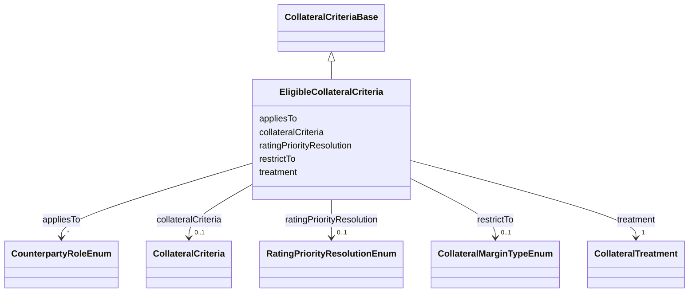

```mermaid
 classDiagram
    class EligibleCollateralCriteria
    click EligibleCollateralCriteria href "../EligibleCollateralCriteria"
      CollateralCriteriaBase <|-- EligibleCollateralCriteria
        click CollateralCriteriaBase href "../CollateralCriteriaBase"
      
      EligibleCollateralCriteria : appliesTo
        
          
    
        
        
        EligibleCollateralCriteria --> "*" CounterpartyRoleEnum : appliesTo
        click CounterpartyRoleEnum href "../CounterpartyRoleEnum"
    

        
      EligibleCollateralCriteria : collateralCriteria
        
          
    
        
        
        EligibleCollateralCriteria --> "0..1" CollateralCriteria : collateralCriteria
        click CollateralCriteria href "../CollateralCriteria"
    

        
      EligibleCollateralCriteria : ratingPriorityResolution
        
          
    
        
        
        EligibleCollateralCriteria --> "0..1" RatingPriorityResolutionEnum : ratingPriorityResolution
        click RatingPriorityResolutionEnum href "../RatingPriorityResolutionEnum"
    

        
      EligibleCollateralCriteria : restrictTo
        
          
    
        
        
        EligibleCollateralCriteria --> "0..1" CollateralMarginTypeEnum : restrictTo
        click CollateralMarginTypeEnum href "../CollateralMarginTypeEnum"
    

        
      EligibleCollateralCriteria : treatment
        
          
    
        
        
        EligibleCollateralCriteria --> "1" CollateralTreatment : treatment
        click CollateralTreatment href "../CollateralTreatment"
    

        
      
```
