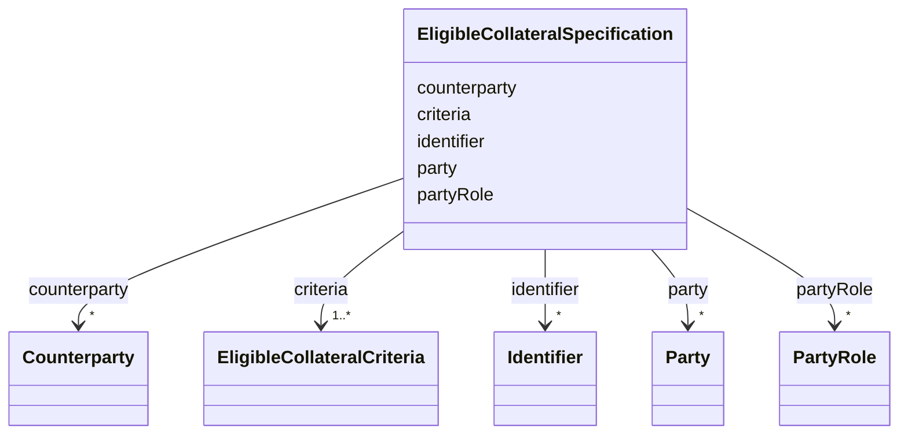

```mermaid
 classDiagram
    class EligibleCollateralSpecification
    click EligibleCollateralSpecification href "../EligibleCollateralSpecification"
      EligibleCollateralSpecification : counterparty
        
          
    
        
        
        EligibleCollateralSpecification --> "*" Counterparty : counterparty
        click Counterparty href "../Counterparty"
    

        
      EligibleCollateralSpecification : criteria
        
          
    
        
        
        EligibleCollateralSpecification --> "1..*" EligibleCollateralCriteria : criteria
        click EligibleCollateralCriteria href "../EligibleCollateralCriteria"
    

        
      EligibleCollateralSpecification : identifier
        
          
    
        
        
        EligibleCollateralSpecification --> "*" Identifier : identifier
        click Identifier href "../Identifier"
    

        
      EligibleCollateralSpecification : party
        
          
    
        
        
        EligibleCollateralSpecification --> "*" Party : party
        click Party href "../Party"
    

        
      EligibleCollateralSpecification : partyRole
        
          
    
        
        
        EligibleCollateralSpecification --> "*" PartyRole : partyRole
        click PartyRole href "../PartyRole"
    

        
      
```
