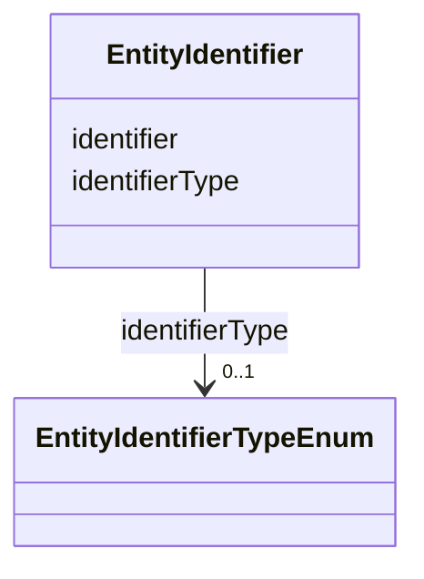

```mermaid
 classDiagram
    class EntityIdentifier
    click EntityIdentifier href "../EntityIdentifier"
      EntityIdentifier : identifier
        
      EntityIdentifier : identifierType
        
          
    
        
        
        EntityIdentifier --> "0..1" EntityIdentifierTypeEnum : identifierType
        click EntityIdentifierTypeEnum href "../EntityIdentifierTypeEnum"
    

        
      
```
