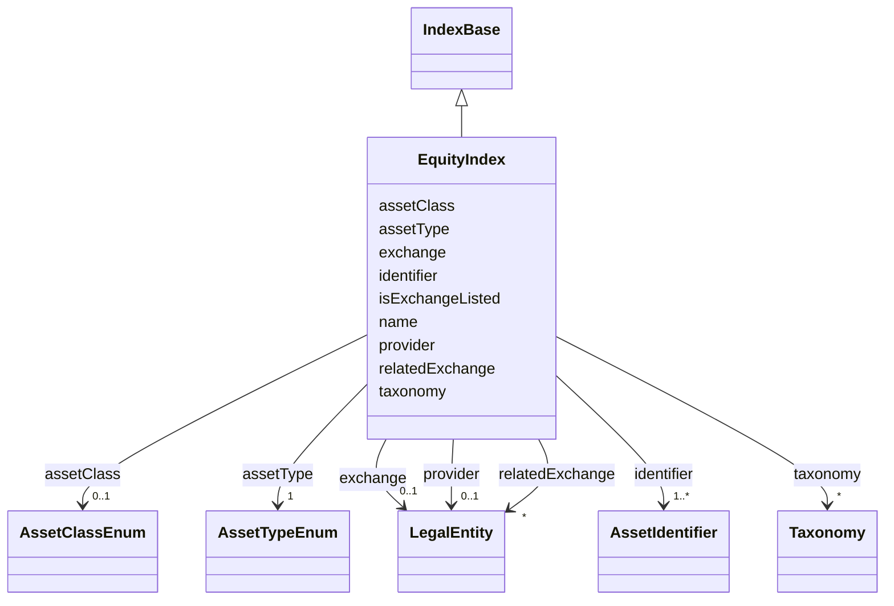

```mermaid
 classDiagram
    class EquityIndex
    click EquityIndex href "../EquityIndex"
      IndexBase <|-- EquityIndex
        click IndexBase href "../IndexBase"
      
      EquityIndex : assetClass
        
          
    
        
        
        EquityIndex --> "0..1" AssetClassEnum : assetClass
        click AssetClassEnum href "../AssetClassEnum"
    

        
      EquityIndex : assetType
        
          
    
        
        
        EquityIndex --> "1" AssetTypeEnum : assetType
        click AssetTypeEnum href "../AssetTypeEnum"
    

        
      EquityIndex : exchange
        
          
    
        
        
        EquityIndex --> "0..1" LegalEntity : exchange
        click LegalEntity href "../LegalEntity"
    

        
      EquityIndex : identifier
        
          
    
        
        
        EquityIndex --> "1..*" AssetIdentifier : identifier
        click AssetIdentifier href "../AssetIdentifier"
    

        
      EquityIndex : isExchangeListed
        
      EquityIndex : name
        
      EquityIndex : provider
        
          
    
        
        
        EquityIndex --> "0..1" LegalEntity : provider
        click LegalEntity href "../LegalEntity"
    

        
      EquityIndex : relatedExchange
        
          
    
        
        
        EquityIndex --> "*" LegalEntity : relatedExchange
        click LegalEntity href "../LegalEntity"
    

        
      EquityIndex : taxonomy
        
          
    
        
        
        EquityIndex --> "*" Taxonomy : taxonomy
        click Taxonomy href "../Taxonomy"
    

        
      
```
