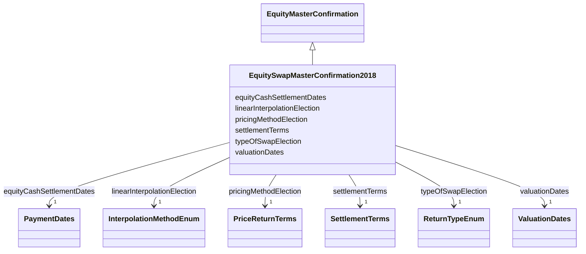

```mermaid
 classDiagram
    class EquitySwapMasterConfirmation2018
    click EquitySwapMasterConfirmation2018 href "../EquitySwapMasterConfirmation2018"
      EquityMasterConfirmation <|-- EquitySwapMasterConfirmation2018
        click EquityMasterConfirmation href "../EquityMasterConfirmation"
      
      EquitySwapMasterConfirmation2018 : equityCashSettlementDates
        
          
    
        
        
        EquitySwapMasterConfirmation2018 --> "1" PaymentDates : equityCashSettlementDates
        click PaymentDates href "../PaymentDates"
    

        
      EquitySwapMasterConfirmation2018 : linearInterpolationElection
        
          
    
        
        
        EquitySwapMasterConfirmation2018 --> "1" InterpolationMethodEnum : linearInterpolationElection
        click InterpolationMethodEnum href "../InterpolationMethodEnum"
    

        
      EquitySwapMasterConfirmation2018 : pricingMethodElection
        
          
    
        
        
        EquitySwapMasterConfirmation2018 --> "1" PriceReturnTerms : pricingMethodElection
        click PriceReturnTerms href "../PriceReturnTerms"
    

        
      EquitySwapMasterConfirmation2018 : settlementTerms
        
          
    
        
        
        EquitySwapMasterConfirmation2018 --> "1" SettlementTerms : settlementTerms
        click SettlementTerms href "../SettlementTerms"
    

        
      EquitySwapMasterConfirmation2018 : typeOfSwapElection
        
          
    
        
        
        EquitySwapMasterConfirmation2018 --> "1" ReturnTypeEnum : typeOfSwapElection
        click ReturnTypeEnum href "../ReturnTypeEnum"
    

        
      EquitySwapMasterConfirmation2018 : valuationDates
        
          
    
        
        
        EquitySwapMasterConfirmation2018 --> "1" ValuationDates : valuationDates
        click ValuationDates href "../ValuationDates"
    

        
      
```
