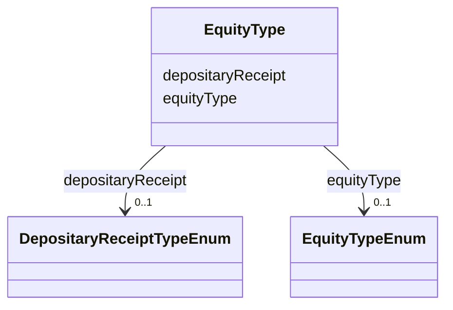

```mermaid
 classDiagram
    class EquityType
    click EquityType href "../EquityType"
      EquityType : depositaryReceipt
        
          
    
        
        
        EquityType --> "0..1" DepositaryReceiptTypeEnum : depositaryReceipt
        click DepositaryReceiptTypeEnum href "../DepositaryReceiptTypeEnum"
    

        
      EquityType : equityType
        
          
    
        
        
        EquityType --> "0..1" EquityTypeEnum : equityType
        click EquityTypeEnum href "../EquityTypeEnum"
    

        
      
```
