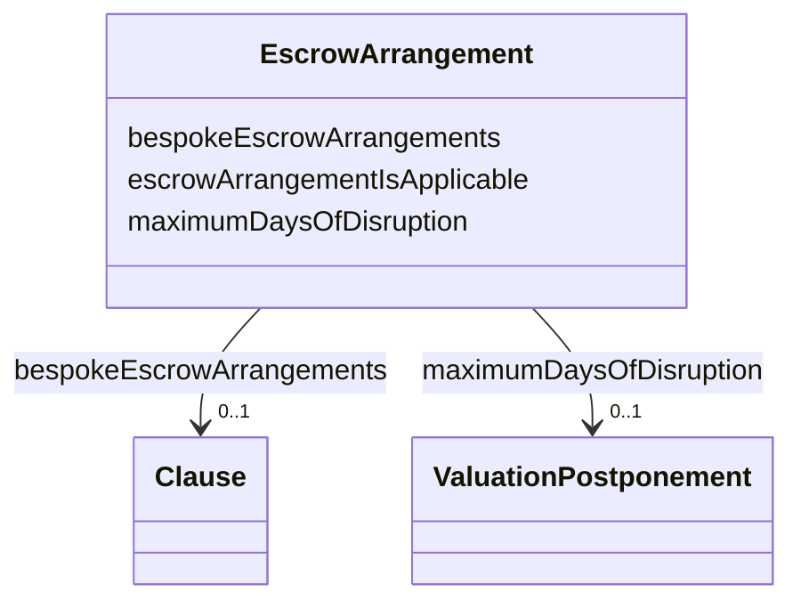

```mermaid
 classDiagram
    class EscrowArrangement
    click EscrowArrangement href "../EscrowArrangement"
      EscrowArrangement : bespokeEscrowArrangements
        
          
    
        
        
        EscrowArrangement --> "0..1" Clause : bespokeEscrowArrangements
        click Clause href "../Clause"
    

        
      EscrowArrangement : escrowArrangementIsApplicable
        
      EscrowArrangement : maximumDaysOfDisruption
        
          
    
        
        
        EscrowArrangement --> "0..1" ValuationPostponement : maximumDaysOfDisruption
        click ValuationPostponement href "../ValuationPostponement"
    

        
      
```
