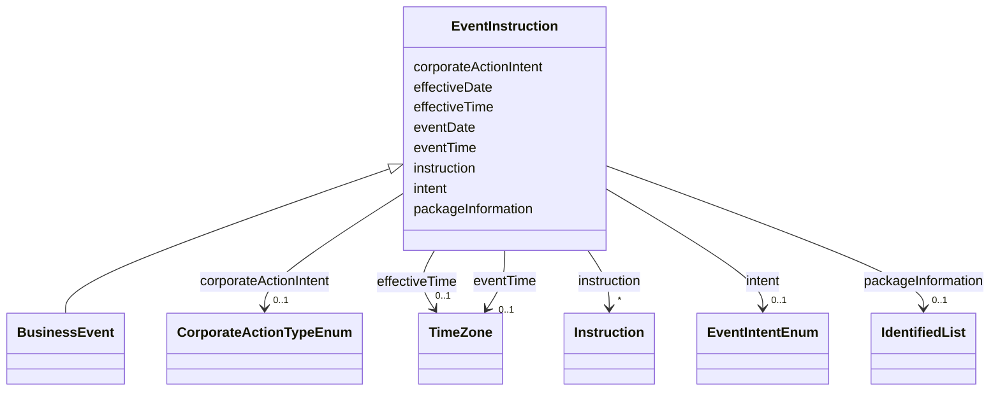

```mermaid
 classDiagram
    class EventInstruction
    click EventInstruction href "../EventInstruction"
      EventInstruction <|-- BusinessEvent
        click BusinessEvent href "../BusinessEvent"
      
      EventInstruction : corporateActionIntent
        
          
    
        
        
        EventInstruction --> "0..1" CorporateActionTypeEnum : corporateActionIntent
        click CorporateActionTypeEnum href "../CorporateActionTypeEnum"
    

        
      EventInstruction : effectiveDate
        
      EventInstruction : effectiveTime
        
          
    
        
        
        EventInstruction --> "0..1" TimeZone : effectiveTime
        click TimeZone href "../TimeZone"
    

        
      EventInstruction : eventDate
        
      EventInstruction : eventTime
        
          
    
        
        
        EventInstruction --> "0..1" TimeZone : eventTime
        click TimeZone href "../TimeZone"
    

        
      EventInstruction : instruction
        
          
    
        
        
        EventInstruction --> "*" Instruction : instruction
        click Instruction href "../Instruction"
    

        
      EventInstruction : intent
        
          
    
        
        
        EventInstruction --> "0..1" EventIntentEnum : intent
        click EventIntentEnum href "../EventIntentEnum"
    

        
      EventInstruction : packageInformation
        
          
    
        
        
        EventInstruction --> "0..1" IdentifiedList : packageInformation
        click IdentifiedList href "../IdentifiedList"
    

        
      
```
