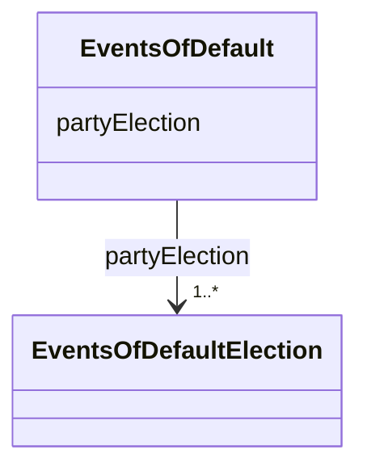

```mermaid
 classDiagram
    class EventsOfDefault
    click EventsOfDefault href "../EventsOfDefault"
      EventsOfDefault : partyElection
        
          
    
        
        
        EventsOfDefault --> "1..*" EventsOfDefaultElection : partyElection
        click EventsOfDefaultElection href "../EventsOfDefaultElection"
    

        
      
```
