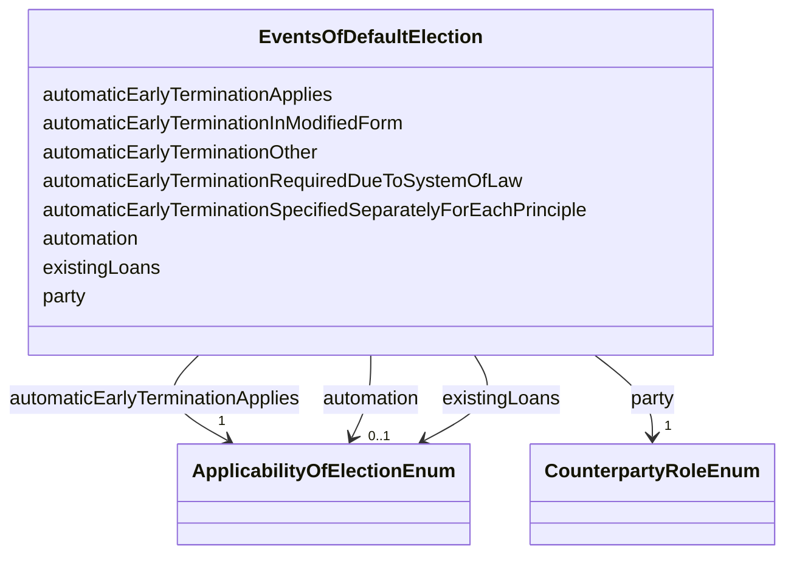

```mermaid
 classDiagram
    class EventsOfDefaultElection
    click EventsOfDefaultElection href "../EventsOfDefaultElection"
      EventsOfDefaultElection : automaticEarlyTerminationApplies
        
          
    
        
        
        EventsOfDefaultElection --> "1" ApplicabilityOfElectionEnum : automaticEarlyTerminationApplies
        click ApplicabilityOfElectionEnum href "../ApplicabilityOfElectionEnum"
    

        
      EventsOfDefaultElection : automaticEarlyTerminationInModifiedForm
        
      EventsOfDefaultElection : automaticEarlyTerminationOther
        
      EventsOfDefaultElection : automaticEarlyTerminationRequiredDueToSystemOfLaw
        
      EventsOfDefaultElection : automaticEarlyTerminationSpecifiedSeparatelyForEachPrinciple
        
      EventsOfDefaultElection : automation
        
          
    
        
        
        EventsOfDefaultElection --> "0..1" ApplicabilityOfElectionEnum : automation
        click ApplicabilityOfElectionEnum href "../ApplicabilityOfElectionEnum"
    

        
      EventsOfDefaultElection : existingLoans
        
          
    
        
        
        EventsOfDefaultElection --> "0..1" ApplicabilityOfElectionEnum : existingLoans
        click ApplicabilityOfElectionEnum href "../ApplicabilityOfElectionEnum"
    

        
      EventsOfDefaultElection : party
        
          
    
        
        
        EventsOfDefaultElection --> "1" CounterpartyRoleEnum : party
        click CounterpartyRoleEnum href "../CounterpartyRoleEnum"
    

        
      
```
