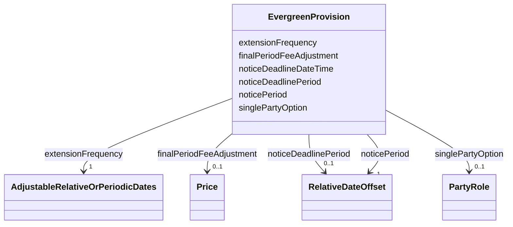

```mermaid
 classDiagram
    class EvergreenProvision
    click EvergreenProvision href "../EvergreenProvision"
      EvergreenProvision : extensionFrequency
        
          
    
        
        
        EvergreenProvision --> "1" AdjustableRelativeOrPeriodicDates : extensionFrequency
        click AdjustableRelativeOrPeriodicDates href "../AdjustableRelativeOrPeriodicDates"
    

        
      EvergreenProvision : finalPeriodFeeAdjustment
        
          
    
        
        
        EvergreenProvision --> "0..1" Price : finalPeriodFeeAdjustment
        click Price href "../Price"
    

        
      EvergreenProvision : noticeDeadlineDateTime
        
      EvergreenProvision : noticeDeadlinePeriod
        
          
    
        
        
        EvergreenProvision --> "0..1" RelativeDateOffset : noticeDeadlinePeriod
        click RelativeDateOffset href "../RelativeDateOffset"
    

        
      EvergreenProvision : noticePeriod
        
          
    
        
        
        EvergreenProvision --> "1" RelativeDateOffset : noticePeriod
        click RelativeDateOffset href "../RelativeDateOffset"
    

        
      EvergreenProvision : singlePartyOption
        
          
    
        
        
        EvergreenProvision --> "0..1" PartyRole : singlePartyOption
        click PartyRole href "../PartyRole"
    

        
      
```
