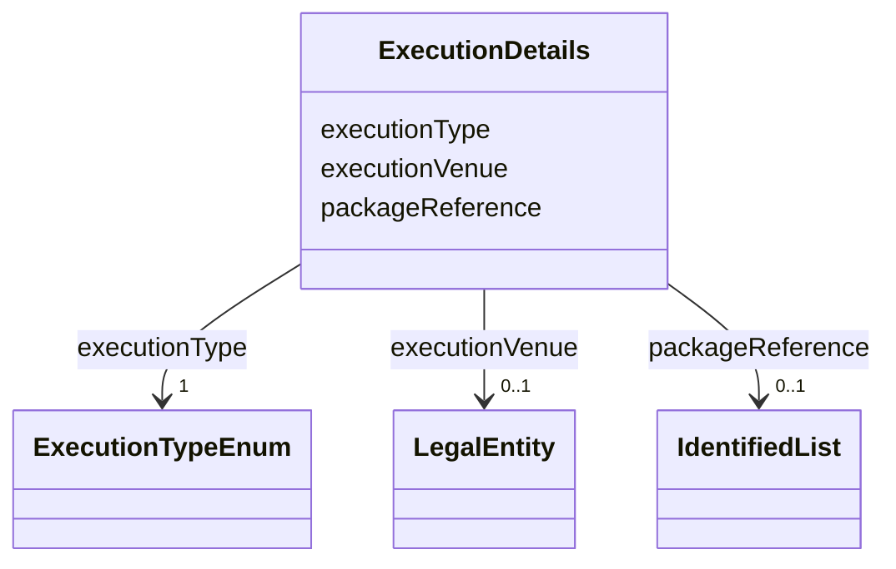

```mermaid
 classDiagram
    class ExecutionDetails
    click ExecutionDetails href "../ExecutionDetails"
      ExecutionDetails : executionType
        
          
    
        
        
        ExecutionDetails --> "1" ExecutionTypeEnum : executionType
        click ExecutionTypeEnum href "../ExecutionTypeEnum"
    

        
      ExecutionDetails : executionVenue
        
          
    
        
        
        ExecutionDetails --> "0..1" LegalEntity : executionVenue
        click LegalEntity href "../LegalEntity"
    

        
      ExecutionDetails : packageReference
        
          
    
        
        
        ExecutionDetails --> "0..1" IdentifiedList : packageReference
        click IdentifiedList href "../IdentifiedList"
    

        
      
```
