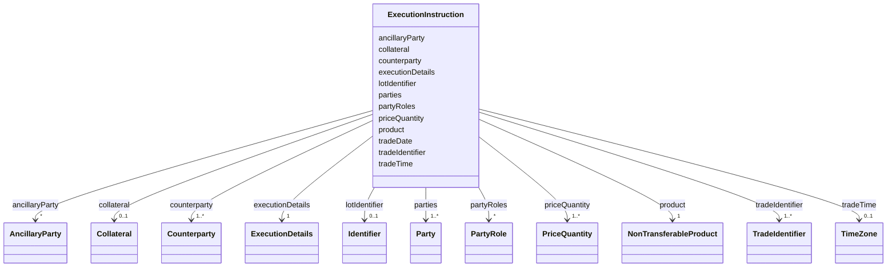

```mermaid
 classDiagram
    class ExecutionInstruction
    click ExecutionInstruction href "../ExecutionInstruction"
      ExecutionInstruction : ancillaryParty
        
          
    
        
        
        ExecutionInstruction --> "*" AncillaryParty : ancillaryParty
        click AncillaryParty href "../AncillaryParty"
    

        
      ExecutionInstruction : collateral
        
          
    
        
        
        ExecutionInstruction --> "0..1" Collateral : collateral
        click Collateral href "../Collateral"
    

        
      ExecutionInstruction : counterparty
        
          
    
        
        
        ExecutionInstruction --> "1..*" Counterparty : counterparty
        click Counterparty href "../Counterparty"
    

        
      ExecutionInstruction : executionDetails
        
          
    
        
        
        ExecutionInstruction --> "1" ExecutionDetails : executionDetails
        click ExecutionDetails href "../ExecutionDetails"
    

        
      ExecutionInstruction : lotIdentifier
        
          
    
        
        
        ExecutionInstruction --> "0..1" Identifier : lotIdentifier
        click Identifier href "../Identifier"
    

        
      ExecutionInstruction : parties
        
          
    
        
        
        ExecutionInstruction --> "1..*" Party : parties
        click Party href "../Party"
    

        
      ExecutionInstruction : partyRoles
        
          
    
        
        
        ExecutionInstruction --> "*" PartyRole : partyRoles
        click PartyRole href "../PartyRole"
    

        
      ExecutionInstruction : priceQuantity
        
          
    
        
        
        ExecutionInstruction --> "1..*" PriceQuantity : priceQuantity
        click PriceQuantity href "../PriceQuantity"
    

        
      ExecutionInstruction : product
        
          
    
        
        
        ExecutionInstruction --> "1" NonTransferableProduct : product
        click NonTransferableProduct href "../NonTransferableProduct"
    

        
      ExecutionInstruction : tradeDate
        
      ExecutionInstruction : tradeIdentifier
        
          
    
        
        
        ExecutionInstruction --> "1..*" TradeIdentifier : tradeIdentifier
        click TradeIdentifier href "../TradeIdentifier"
    

        
      ExecutionInstruction : tradeTime
        
          
    
        
        
        ExecutionInstruction --> "0..1" TimeZone : tradeTime
        click TimeZone href "../TimeZone"
    

        
      
```
