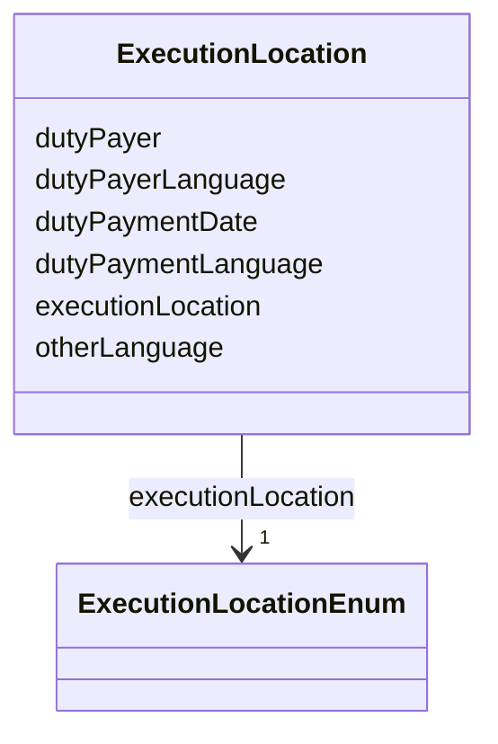

```mermaid
 classDiagram
    class ExecutionLocation
    click ExecutionLocation href "../ExecutionLocation"
      ExecutionLocation : dutyPayer
        
      ExecutionLocation : dutyPayerLanguage
        
      ExecutionLocation : dutyPaymentDate
        
      ExecutionLocation : dutyPaymentLanguage
        
      ExecutionLocation : executionLocation
        
          
    
        
        
        ExecutionLocation --> "1" ExecutionLocationEnum : executionLocation
        click ExecutionLocationEnum href "../ExecutionLocationEnum"
    

        
      ExecutionLocation : otherLanguage
        
      
```
