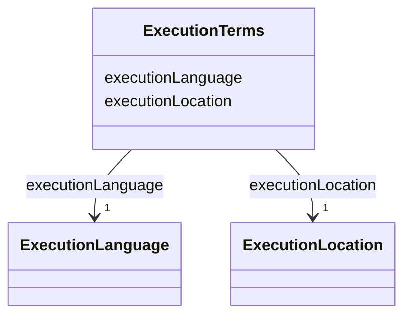

```mermaid
 classDiagram
    class ExecutionTerms
    click ExecutionTerms href "../ExecutionTerms"
      ExecutionTerms : executionLanguage
        
          
    
        
        
        ExecutionTerms --> "1" ExecutionLanguage : executionLanguage
        click ExecutionLanguage href "../ExecutionLanguage"
    

        
      ExecutionTerms : executionLocation
        
          
    
        
        
        ExecutionTerms --> "1" ExecutionLocation : executionLocation
        click ExecutionLocation href "../ExecutionLocation"
    

        
      
```
