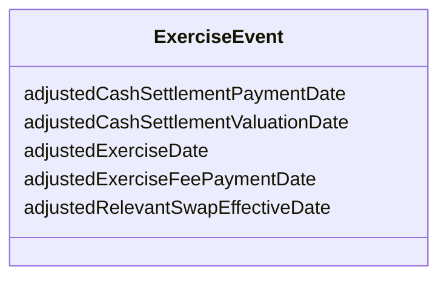

```mermaid
 classDiagram
    class ExerciseEvent
    click ExerciseEvent href "../ExerciseEvent"
      ExerciseEvent : adjustedCashSettlementPaymentDate
        
      ExerciseEvent : adjustedCashSettlementValuationDate
        
      ExerciseEvent : adjustedExerciseDate
        
      ExerciseEvent : adjustedExerciseFeePaymentDate
        
      ExerciseEvent : adjustedRelevantSwapEffectiveDate
        
      
```
