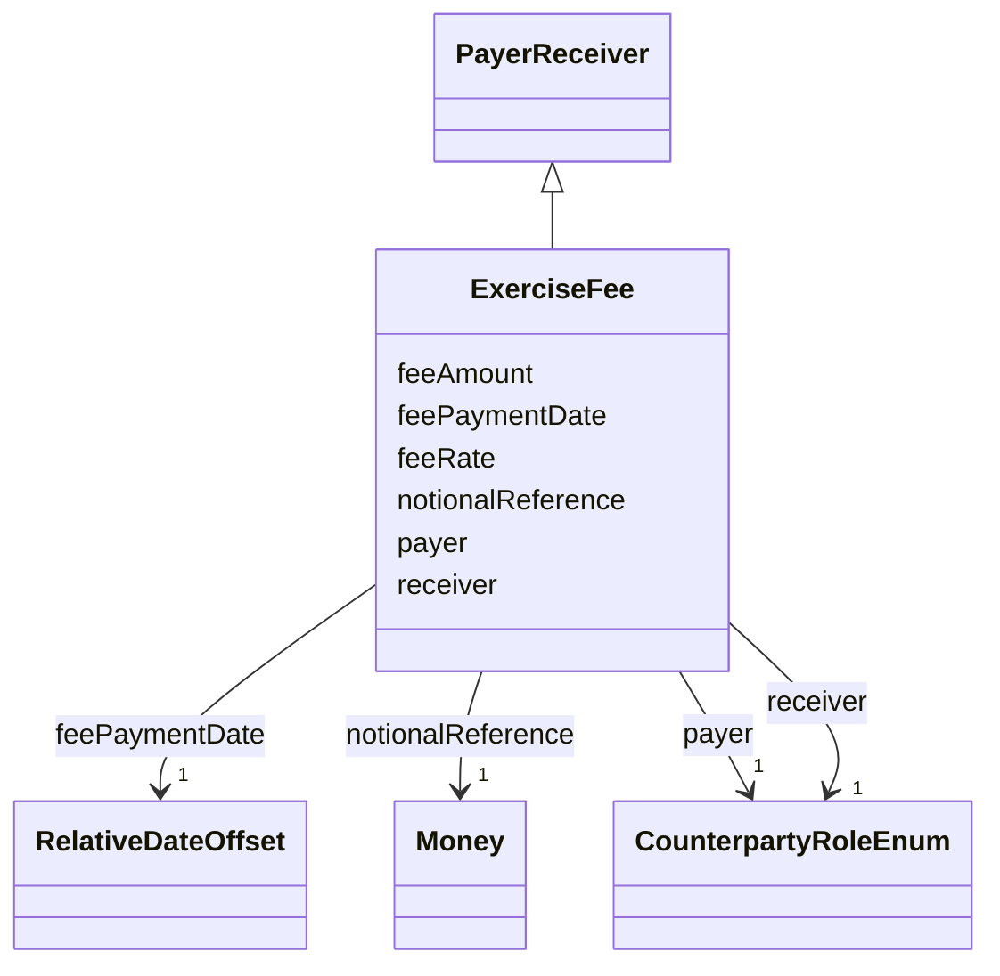

```mermaid
 classDiagram
    class ExerciseFee
    click ExerciseFee href "../ExerciseFee"
      PayerReceiver <|-- ExerciseFee
        click PayerReceiver href "../PayerReceiver"
      
      ExerciseFee : feeAmount
        
      ExerciseFee : feePaymentDate
        
          
    
        
        
        ExerciseFee --> "1" RelativeDateOffset : feePaymentDate
        click RelativeDateOffset href "../RelativeDateOffset"
    

        
      ExerciseFee : feeRate
        
      ExerciseFee : notionalReference
        
          
    
        
        
        ExerciseFee --> "1" Money : notionalReference
        click Money href "../Money"
    

        
      ExerciseFee : payer
        
          
    
        
        
        ExerciseFee --> "1" CounterpartyRoleEnum : payer
        click CounterpartyRoleEnum href "../CounterpartyRoleEnum"
    

        
      ExerciseFee : receiver
        
          
    
        
        
        ExerciseFee --> "1" CounterpartyRoleEnum : receiver
        click CounterpartyRoleEnum href "../CounterpartyRoleEnum"
    

        
      
```
