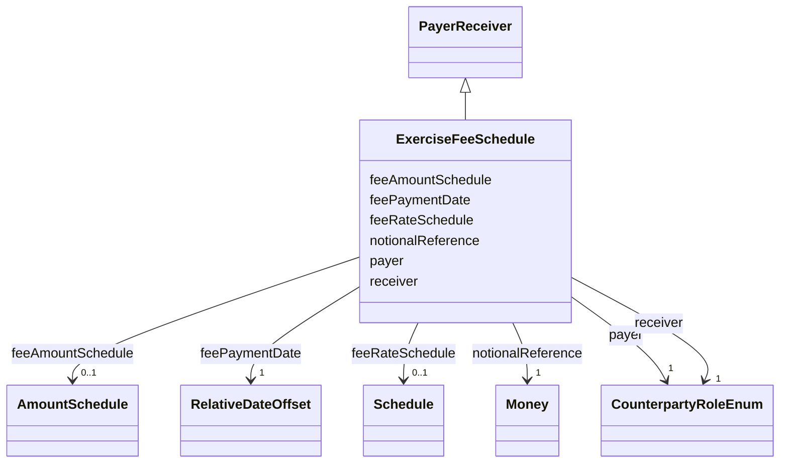

```mermaid
 classDiagram
    class ExerciseFeeSchedule
    click ExerciseFeeSchedule href "../ExerciseFeeSchedule"
      PayerReceiver <|-- ExerciseFeeSchedule
        click PayerReceiver href "../PayerReceiver"
      
      ExerciseFeeSchedule : feeAmountSchedule
        
          
    
        
        
        ExerciseFeeSchedule --> "0..1" AmountSchedule : feeAmountSchedule
        click AmountSchedule href "../AmountSchedule"
    

        
      ExerciseFeeSchedule : feePaymentDate
        
          
    
        
        
        ExerciseFeeSchedule --> "1" RelativeDateOffset : feePaymentDate
        click RelativeDateOffset href "../RelativeDateOffset"
    

        
      ExerciseFeeSchedule : feeRateSchedule
        
          
    
        
        
        ExerciseFeeSchedule --> "0..1" Schedule : feeRateSchedule
        click Schedule href "../Schedule"
    

        
      ExerciseFeeSchedule : notionalReference
        
          
    
        
        
        ExerciseFeeSchedule --> "1" Money : notionalReference
        click Money href "../Money"
    

        
      ExerciseFeeSchedule : payer
        
          
    
        
        
        ExerciseFeeSchedule --> "1" CounterpartyRoleEnum : payer
        click CounterpartyRoleEnum href "../CounterpartyRoleEnum"
    

        
      ExerciseFeeSchedule : receiver
        
          
    
        
        
        ExerciseFeeSchedule --> "1" CounterpartyRoleEnum : receiver
        click CounterpartyRoleEnum href "../CounterpartyRoleEnum"
    

        
      
```
