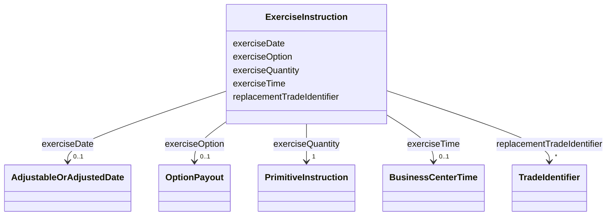

```mermaid
 classDiagram
    class ExerciseInstruction
    click ExerciseInstruction href "../ExerciseInstruction"
      ExerciseInstruction : exerciseDate
        
          
    
        
        
        ExerciseInstruction --> "0..1" AdjustableOrAdjustedDate : exerciseDate
        click AdjustableOrAdjustedDate href "../AdjustableOrAdjustedDate"
    

        
      ExerciseInstruction : exerciseOption
        
          
    
        
        
        ExerciseInstruction --> "0..1" OptionPayout : exerciseOption
        click OptionPayout href "../OptionPayout"
    

        
      ExerciseInstruction : exerciseQuantity
        
          
    
        
        
        ExerciseInstruction --> "1" PrimitiveInstruction : exerciseQuantity
        click PrimitiveInstruction href "../PrimitiveInstruction"
    

        
      ExerciseInstruction : exerciseTime
        
          
    
        
        
        ExerciseInstruction --> "0..1" BusinessCenterTime : exerciseTime
        click BusinessCenterTime href "../BusinessCenterTime"
    

        
      ExerciseInstruction : replacementTradeIdentifier
        
          
    
        
        
        ExerciseInstruction --> "*" TradeIdentifier : replacementTradeIdentifier
        click TradeIdentifier href "../TradeIdentifier"
    

        
      
```
