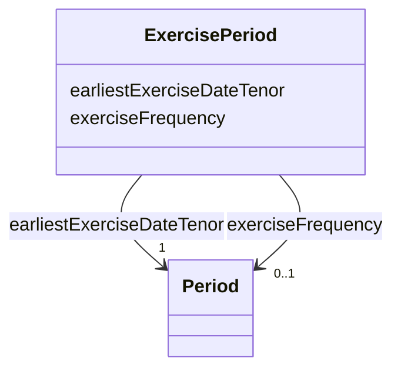

```mermaid
 classDiagram
    class ExercisePeriod
    click ExercisePeriod href "../ExercisePeriod"
      ExercisePeriod : earliestExerciseDateTenor
        
          
    
        
        
        ExercisePeriod --> "1" Period : earliestExerciseDateTenor
        click Period href "../Period"
    

        
      ExercisePeriod : exerciseFrequency
        
          
    
        
        
        ExercisePeriod --> "0..1" Period : exerciseFrequency
        click Period href "../Period"
    

        
      
```
