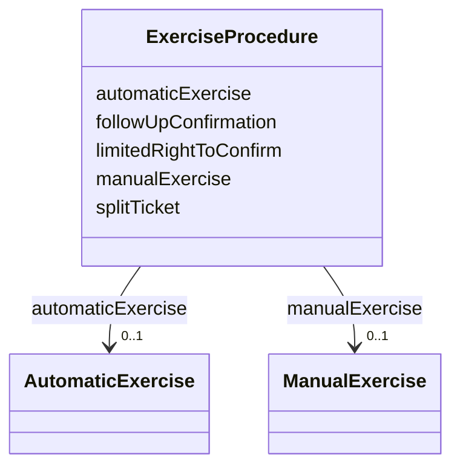

```mermaid
 classDiagram
    class ExerciseProcedure
    click ExerciseProcedure href "../ExerciseProcedure"
      ExerciseProcedure : automaticExercise
        
          
    
        
        
        ExerciseProcedure --> "0..1" AutomaticExercise : automaticExercise
        click AutomaticExercise href "../AutomaticExercise"
    

        
      ExerciseProcedure : followUpConfirmation
        
      ExerciseProcedure : limitedRightToConfirm
        
      ExerciseProcedure : manualExercise
        
          
    
        
        
        ExerciseProcedure --> "0..1" ManualExercise : manualExercise
        click ManualExercise href "../ManualExercise"
    

        
      ExerciseProcedure : splitTicket
        
      
```
