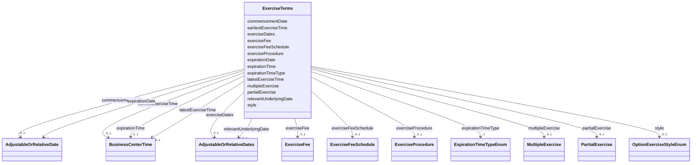

```mermaid
 classDiagram
    class ExerciseTerms
    click ExerciseTerms href "../ExerciseTerms"
      ExerciseTerms : commencementDate
        
          
    
        
        
        ExerciseTerms --> "0..1" AdjustableOrRelativeDate : commencementDate
        click AdjustableOrRelativeDate href "../AdjustableOrRelativeDate"
    

        
      ExerciseTerms : earliestExerciseTime
        
          
    
        
        
        ExerciseTerms --> "0..1" BusinessCenterTime : earliestExerciseTime
        click BusinessCenterTime href "../BusinessCenterTime"
    

        
      ExerciseTerms : exerciseDates
        
          
    
        
        
        ExerciseTerms --> "0..1" AdjustableOrRelativeDates : exerciseDates
        click AdjustableOrRelativeDates href "../AdjustableOrRelativeDates"
    

        
      ExerciseTerms : exerciseFee
        
          
    
        
        
        ExerciseTerms --> "0..1" ExerciseFee : exerciseFee
        click ExerciseFee href "../ExerciseFee"
    

        
      ExerciseTerms : exerciseFeeSchedule
        
          
    
        
        
        ExerciseTerms --> "0..1" ExerciseFeeSchedule : exerciseFeeSchedule
        click ExerciseFeeSchedule href "../ExerciseFeeSchedule"
    

        
      ExerciseTerms : exerciseProcedure
        
          
    
        
        
        ExerciseTerms --> "0..1" ExerciseProcedure : exerciseProcedure
        click ExerciseProcedure href "../ExerciseProcedure"
    

        
      ExerciseTerms : expirationDate
        
          
    
        
        
        ExerciseTerms --> "*" AdjustableOrRelativeDate : expirationDate
        click AdjustableOrRelativeDate href "../AdjustableOrRelativeDate"
    

        
      ExerciseTerms : expirationTime
        
          
    
        
        
        ExerciseTerms --> "0..1" BusinessCenterTime : expirationTime
        click BusinessCenterTime href "../BusinessCenterTime"
    

        
      ExerciseTerms : expirationTimeType
        
          
    
        
        
        ExerciseTerms --> "1" ExpirationTimeTypeEnum : expirationTimeType
        click ExpirationTimeTypeEnum href "../ExpirationTimeTypeEnum"
    

        
      ExerciseTerms : latestExerciseTime
        
          
    
        
        
        ExerciseTerms --> "0..1" BusinessCenterTime : latestExerciseTime
        click BusinessCenterTime href "../BusinessCenterTime"
    

        
      ExerciseTerms : multipleExercise
        
          
    
        
        
        ExerciseTerms --> "0..1" MultipleExercise : multipleExercise
        click MultipleExercise href "../MultipleExercise"
    

        
      ExerciseTerms : partialExercise
        
          
    
        
        
        ExerciseTerms --> "0..1" PartialExercise : partialExercise
        click PartialExercise href "../PartialExercise"
    

        
      ExerciseTerms : relevantUnderlyingDate
        
          
    
        
        
        ExerciseTerms --> "0..1" AdjustableOrRelativeDates : relevantUnderlyingDate
        click AdjustableOrRelativeDates href "../AdjustableOrRelativeDates"
    

        
      ExerciseTerms : style
        
          
    
        
        
        ExerciseTerms --> "0..1" OptionExerciseStyleEnum : style
        click OptionExerciseStyleEnum href "../OptionExerciseStyleEnum"
    

        
      
```
