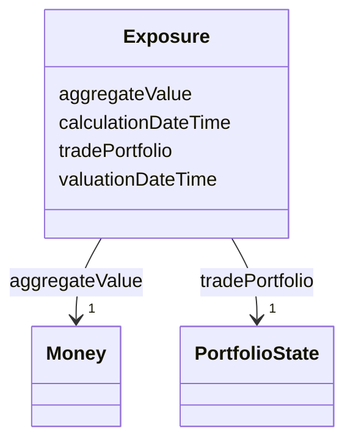

```mermaid
 classDiagram
    class Exposure
    click Exposure href "../Exposure"
      Exposure : aggregateValue
        
          
    
        
        
        Exposure --> "1" Money : aggregateValue
        click Money href "../Money"
    

        
      Exposure : calculationDateTime
        
      Exposure : tradePortfolio
        
          
    
        
        
        Exposure --> "1" PortfolioState : tradePortfolio
        click PortfolioState href "../PortfolioState"
    

        
      Exposure : valuationDateTime
        
      
```
