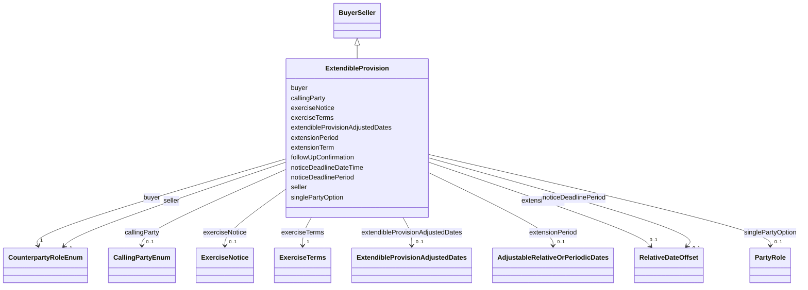

```mermaid
 classDiagram
    class ExtendibleProvision
    click ExtendibleProvision href "../ExtendibleProvision"
      BuyerSeller <|-- ExtendibleProvision
        click BuyerSeller href "../BuyerSeller"
      
      ExtendibleProvision : buyer
        
          
    
        
        
        ExtendibleProvision --> "1" CounterpartyRoleEnum : buyer
        click CounterpartyRoleEnum href "../CounterpartyRoleEnum"
    

        
      ExtendibleProvision : callingParty
        
          
    
        
        
        ExtendibleProvision --> "0..1" CallingPartyEnum : callingParty
        click CallingPartyEnum href "../CallingPartyEnum"
    

        
      ExtendibleProvision : exerciseNotice
        
          
    
        
        
        ExtendibleProvision --> "0..1" ExerciseNotice : exerciseNotice
        click ExerciseNotice href "../ExerciseNotice"
    

        
      ExtendibleProvision : exerciseTerms
        
          
    
        
        
        ExtendibleProvision --> "1" ExerciseTerms : exerciseTerms
        click ExerciseTerms href "../ExerciseTerms"
    

        
      ExtendibleProvision : extendibleProvisionAdjustedDates
        
          
    
        
        
        ExtendibleProvision --> "0..1" ExtendibleProvisionAdjustedDates : extendibleProvisionAdjustedDates
        click ExtendibleProvisionAdjustedDates href "../ExtendibleProvisionAdjustedDates"
    

        
      ExtendibleProvision : extensionPeriod
        
          
    
        
        
        ExtendibleProvision --> "0..1" AdjustableRelativeOrPeriodicDates : extensionPeriod
        click AdjustableRelativeOrPeriodicDates href "../AdjustableRelativeOrPeriodicDates"
    

        
      ExtendibleProvision : extensionTerm
        
          
    
        
        
        ExtendibleProvision --> "0..1" RelativeDateOffset : extensionTerm
        click RelativeDateOffset href "../RelativeDateOffset"
    

        
      ExtendibleProvision : followUpConfirmation
        
      ExtendibleProvision : noticeDeadlineDateTime
        
      ExtendibleProvision : noticeDeadlinePeriod
        
          
    
        
        
        ExtendibleProvision --> "0..1" RelativeDateOffset : noticeDeadlinePeriod
        click RelativeDateOffset href "../RelativeDateOffset"
    

        
      ExtendibleProvision : seller
        
          
    
        
        
        ExtendibleProvision --> "1" CounterpartyRoleEnum : seller
        click CounterpartyRoleEnum href "../CounterpartyRoleEnum"
    

        
      ExtendibleProvision : singlePartyOption
        
          
    
        
        
        ExtendibleProvision --> "0..1" PartyRole : singlePartyOption
        click PartyRole href "../PartyRole"
    

        
      
```
