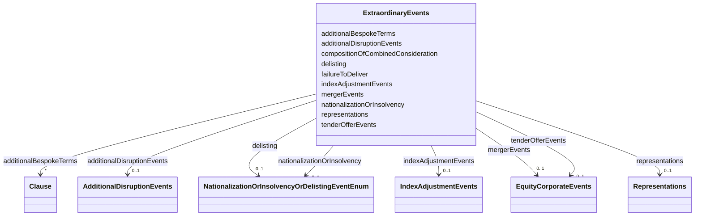

```mermaid
 classDiagram
    class ExtraordinaryEvents
    click ExtraordinaryEvents href "../ExtraordinaryEvents"
      ExtraordinaryEvents : additionalBespokeTerms
        
          
    
        
        
        ExtraordinaryEvents --> "*" Clause : additionalBespokeTerms
        click Clause href "../Clause"
    

        
      ExtraordinaryEvents : additionalDisruptionEvents
        
          
    
        
        
        ExtraordinaryEvents --> "0..1" AdditionalDisruptionEvents : additionalDisruptionEvents
        click AdditionalDisruptionEvents href "../AdditionalDisruptionEvents"
    

        
      ExtraordinaryEvents : compositionOfCombinedConsideration
        
      ExtraordinaryEvents : delisting
        
          
    
        
        
        ExtraordinaryEvents --> "0..1" NationalizationOrInsolvencyOrDelistingEventEnum : delisting
        click NationalizationOrInsolvencyOrDelistingEventEnum href "../NationalizationOrInsolvencyOrDelistingEventEnum"
    

        
      ExtraordinaryEvents : failureToDeliver
        
      ExtraordinaryEvents : indexAdjustmentEvents
        
          
    
        
        
        ExtraordinaryEvents --> "0..1" IndexAdjustmentEvents : indexAdjustmentEvents
        click IndexAdjustmentEvents href "../IndexAdjustmentEvents"
    

        
      ExtraordinaryEvents : mergerEvents
        
          
    
        
        
        ExtraordinaryEvents --> "0..1" EquityCorporateEvents : mergerEvents
        click EquityCorporateEvents href "../EquityCorporateEvents"
    

        
      ExtraordinaryEvents : nationalizationOrInsolvency
        
          
    
        
        
        ExtraordinaryEvents --> "0..1" NationalizationOrInsolvencyOrDelistingEventEnum : nationalizationOrInsolvency
        click NationalizationOrInsolvencyOrDelistingEventEnum href "../NationalizationOrInsolvencyOrDelistingEventEnum"
    

        
      ExtraordinaryEvents : representations
        
          
    
        
        
        ExtraordinaryEvents --> "0..1" Representations : representations
        click Representations href "../Representations"
    

        
      ExtraordinaryEvents : tenderOfferEvents
        
          
    
        
        
        ExtraordinaryEvents --> "0..1" EquityCorporateEvents : tenderOfferEvents
        click EquityCorporateEvents href "../EquityCorporateEvents"
    

        
      
```
