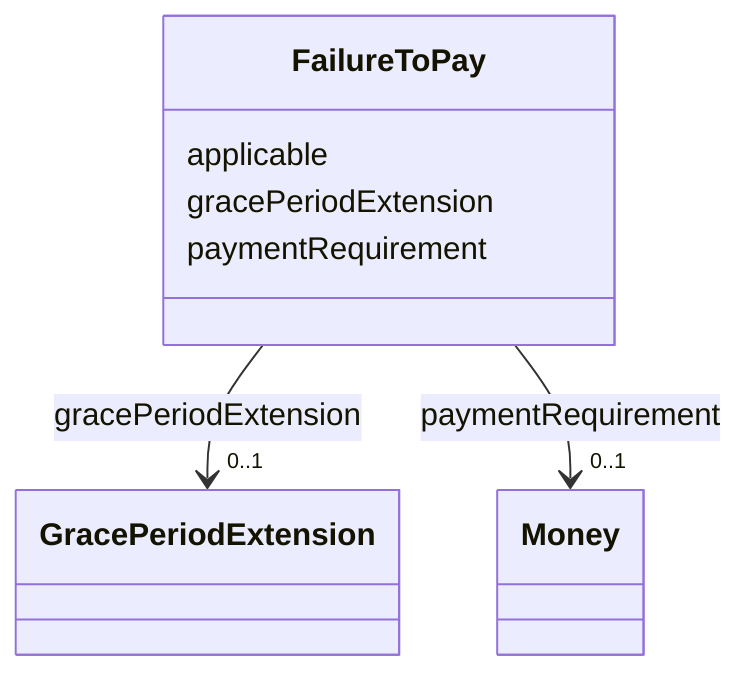

```mermaid
 classDiagram
    class FailureToPay
    click FailureToPay href "../FailureToPay"
      FailureToPay : applicable
        
      FailureToPay : gracePeriodExtension
        
          
    
        
        
        FailureToPay --> "0..1" GracePeriodExtension : gracePeriodExtension
        click GracePeriodExtension href "../GracePeriodExtension"
    

        
      FailureToPay : paymentRequirement
        
          
    
        
        
        FailureToPay --> "0..1" Money : paymentRequirement
        click Money href "../Money"
    

        
      
```
