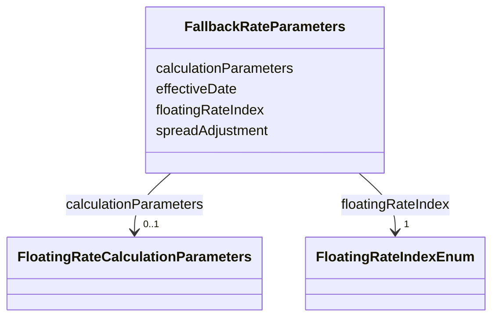

```mermaid
 classDiagram
    class FallbackRateParameters
    click FallbackRateParameters href "../FallbackRateParameters"
      FallbackRateParameters : calculationParameters
        
          
    
        
        
        FallbackRateParameters --> "0..1" FloatingRateCalculationParameters : calculationParameters
        click FloatingRateCalculationParameters href "../FloatingRateCalculationParameters"
    

        
      FallbackRateParameters : effectiveDate
        
      FallbackRateParameters : floatingRateIndex
        
          
    
        
        
        FallbackRateParameters --> "1" FloatingRateIndexEnum : floatingRateIndex
        click FloatingRateIndexEnum href "../FloatingRateIndexEnum"
    

        
      FallbackRateParameters : spreadAdjustment
        
      
```
