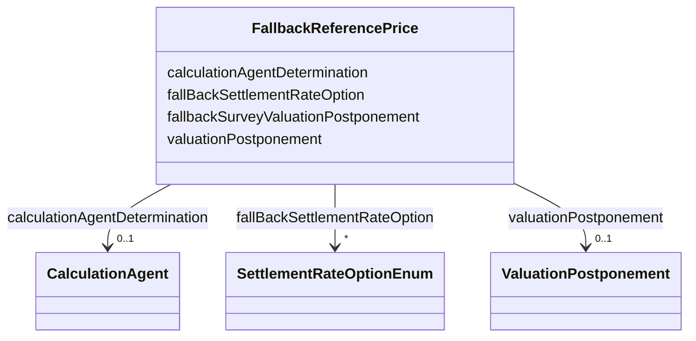

```mermaid
 classDiagram
    class FallbackReferencePrice
    click FallbackReferencePrice href "../FallbackReferencePrice"
      FallbackReferencePrice : calculationAgentDetermination
        
          
    
        
        
        FallbackReferencePrice --> "0..1" CalculationAgent : calculationAgentDetermination
        click CalculationAgent href "../CalculationAgent"
    

        
      FallbackReferencePrice : fallBackSettlementRateOption
        
          
    
        
        
        FallbackReferencePrice --> "*" SettlementRateOptionEnum : fallBackSettlementRateOption
        click SettlementRateOptionEnum href "../SettlementRateOptionEnum"
    

        
      FallbackReferencePrice : fallbackSurveyValuationPostponement
        
      FallbackReferencePrice : valuationPostponement
        
          
    
        
        
        FallbackReferencePrice --> "0..1" ValuationPostponement : valuationPostponement
        click ValuationPostponement href "../ValuationPostponement"
    

        
      
```
