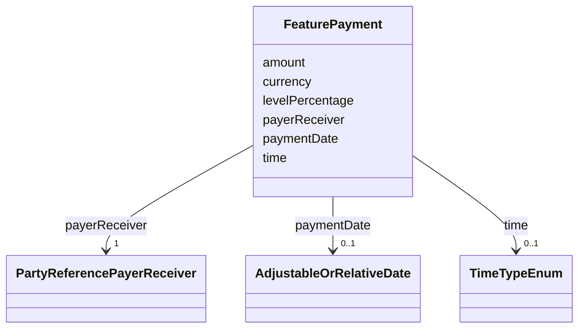

```mermaid
 classDiagram
    class FeaturePayment
    click FeaturePayment href "../FeaturePayment"
      FeaturePayment : amount
        
      FeaturePayment : currency
        
      FeaturePayment : levelPercentage
        
      FeaturePayment : payerReceiver
        
          
    
        
        
        FeaturePayment --> "1" PartyReferencePayerReceiver : payerReceiver
        click PartyReferencePayerReceiver href "../PartyReferencePayerReceiver"
    

        
      FeaturePayment : paymentDate
        
          
    
        
        
        FeaturePayment --> "0..1" AdjustableOrRelativeDate : paymentDate
        click AdjustableOrRelativeDate href "../AdjustableOrRelativeDate"
    

        
      FeaturePayment : time
        
          
    
        
        
        FeaturePayment --> "0..1" TimeTypeEnum : time
        click TimeTypeEnum href "../TimeTypeEnum"
    

        
      
```
