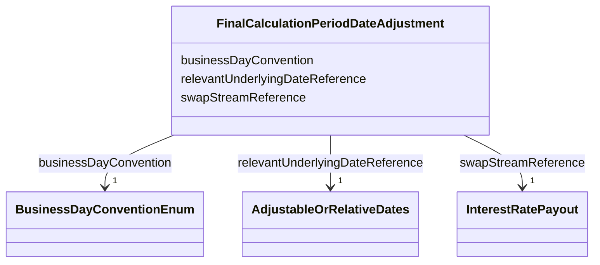

```mermaid
 classDiagram
    class FinalCalculationPeriodDateAdjustment
    click FinalCalculationPeriodDateAdjustment href "../FinalCalculationPeriodDateAdjustment"
      FinalCalculationPeriodDateAdjustment : businessDayConvention
        
          
    
        
        
        FinalCalculationPeriodDateAdjustment --> "1" BusinessDayConventionEnum : businessDayConvention
        click BusinessDayConventionEnum href "../BusinessDayConventionEnum"
    

        
      FinalCalculationPeriodDateAdjustment : relevantUnderlyingDateReference
        
          
    
        
        
        FinalCalculationPeriodDateAdjustment --> "1" AdjustableOrRelativeDates : relevantUnderlyingDateReference
        click AdjustableOrRelativeDates href "../AdjustableOrRelativeDates"
    

        
      FinalCalculationPeriodDateAdjustment : swapStreamReference
        
          
    
        
        
        FinalCalculationPeriodDateAdjustment --> "1" InterestRatePayout : swapStreamReference
        click InterestRatePayout href "../InterestRatePayout"
    

        
      
```
