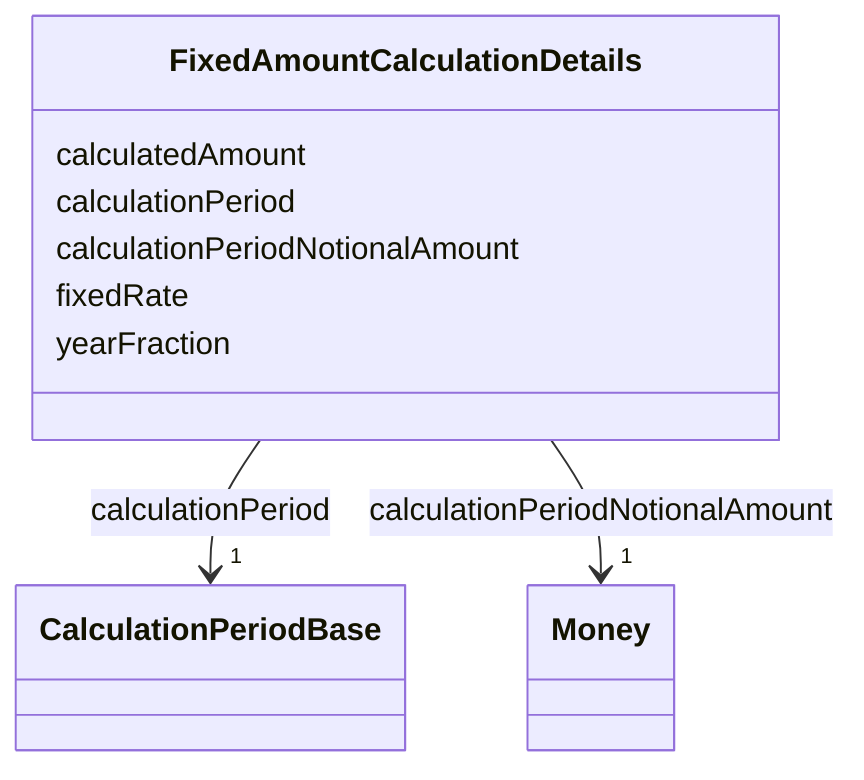

```mermaid
 classDiagram
    class FixedAmountCalculationDetails
    click FixedAmountCalculationDetails href "../FixedAmountCalculationDetails"
      FixedAmountCalculationDetails : calculatedAmount
        
      FixedAmountCalculationDetails : calculationPeriod
        
          
    
        
        
        FixedAmountCalculationDetails --> "1" CalculationPeriodBase : calculationPeriod
        click CalculationPeriodBase href "../CalculationPeriodBase"
    

        
      FixedAmountCalculationDetails : calculationPeriodNotionalAmount
        
          
    
        
        
        FixedAmountCalculationDetails --> "1" Money : calculationPeriodNotionalAmount
        click Money href "../Money"
    

        
      FixedAmountCalculationDetails : fixedRate
        
      FixedAmountCalculationDetails : yearFraction
        
      
```
