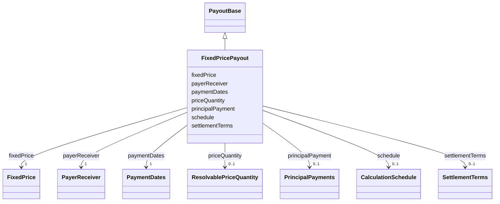

```mermaid
 classDiagram
    class FixedPricePayout
    click FixedPricePayout href "../FixedPricePayout"
      PayoutBase <|-- FixedPricePayout
        click PayoutBase href "../PayoutBase"
      
      FixedPricePayout : fixedPrice
        
          
    
        
        
        FixedPricePayout --> "1" FixedPrice : fixedPrice
        click FixedPrice href "../FixedPrice"
    

        
      FixedPricePayout : payerReceiver
        
          
    
        
        
        FixedPricePayout --> "1" PayerReceiver : payerReceiver
        click PayerReceiver href "../PayerReceiver"
    

        
      FixedPricePayout : paymentDates
        
          
    
        
        
        FixedPricePayout --> "1" PaymentDates : paymentDates
        click PaymentDates href "../PaymentDates"
    

        
      FixedPricePayout : priceQuantity
        
          
    
        
        
        FixedPricePayout --> "0..1" ResolvablePriceQuantity : priceQuantity
        click ResolvablePriceQuantity href "../ResolvablePriceQuantity"
    

        
      FixedPricePayout : principalPayment
        
          
    
        
        
        FixedPricePayout --> "0..1" PrincipalPayments : principalPayment
        click PrincipalPayments href "../PrincipalPayments"
    

        
      FixedPricePayout : schedule
        
          
    
        
        
        FixedPricePayout --> "0..1" CalculationSchedule : schedule
        click CalculationSchedule href "../CalculationSchedule"
    

        
      FixedPricePayout : settlementTerms
        
          
    
        
        
        FixedPricePayout --> "0..1" SettlementTerms : settlementTerms
        click SettlementTerms href "../SettlementTerms"
    

        
      
```
