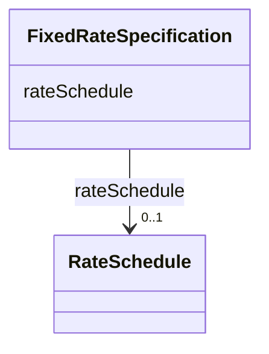

```mermaid
 classDiagram
    class FixedRateSpecification
    click FixedRateSpecification href "../FixedRateSpecification"
      FixedRateSpecification : rateSchedule
        
          
    
        
        
        FixedRateSpecification --> "0..1" RateSchedule : rateSchedule
        click RateSchedule href "../RateSchedule"
    

        
      
```
