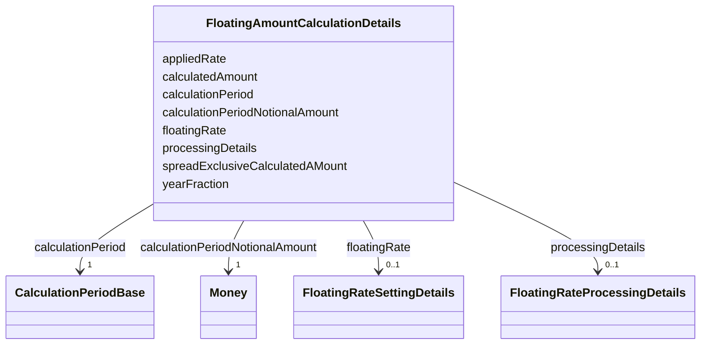

```mermaid
 classDiagram
    class FloatingAmountCalculationDetails
    click FloatingAmountCalculationDetails href "../FloatingAmountCalculationDetails"
      FloatingAmountCalculationDetails : appliedRate
        
      FloatingAmountCalculationDetails : calculatedAmount
        
      FloatingAmountCalculationDetails : calculationPeriod
        
          
    
        
        
        FloatingAmountCalculationDetails --> "1" CalculationPeriodBase : calculationPeriod
        click CalculationPeriodBase href "../CalculationPeriodBase"
    

        
      FloatingAmountCalculationDetails : calculationPeriodNotionalAmount
        
          
    
        
        
        FloatingAmountCalculationDetails --> "1" Money : calculationPeriodNotionalAmount
        click Money href "../Money"
    

        
      FloatingAmountCalculationDetails : floatingRate
        
          
    
        
        
        FloatingAmountCalculationDetails --> "0..1" FloatingRateSettingDetails : floatingRate
        click FloatingRateSettingDetails href "../FloatingRateSettingDetails"
    

        
      FloatingAmountCalculationDetails : processingDetails
        
          
    
        
        
        FloatingAmountCalculationDetails --> "0..1" FloatingRateProcessingDetails : processingDetails
        click FloatingRateProcessingDetails href "../FloatingRateProcessingDetails"
    

        
      FloatingAmountCalculationDetails : spreadExclusiveCalculatedAMount
        
      FloatingAmountCalculationDetails : yearFraction
        
      
```
