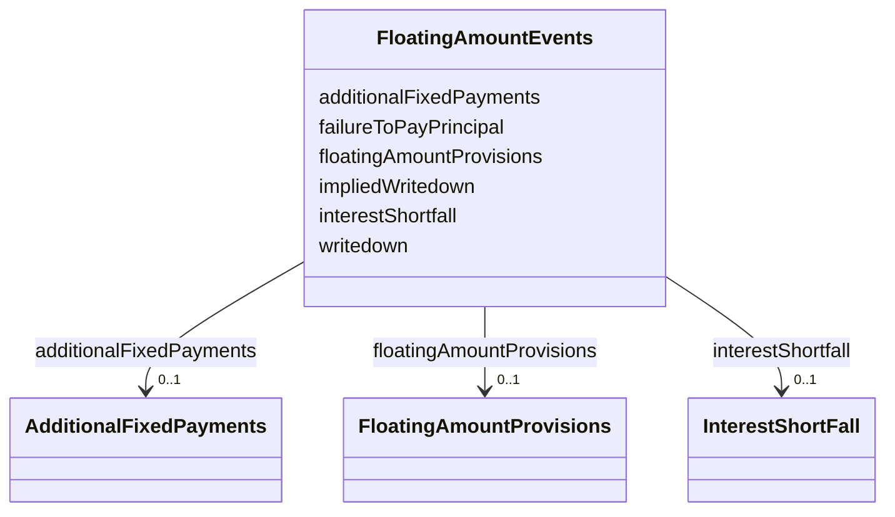

```mermaid
 classDiagram
    class FloatingAmountEvents
    click FloatingAmountEvents href "../FloatingAmountEvents"
      FloatingAmountEvents : additionalFixedPayments
        
          
    
        
        
        FloatingAmountEvents --> "0..1" AdditionalFixedPayments : additionalFixedPayments
        click AdditionalFixedPayments href "../AdditionalFixedPayments"
    

        
      FloatingAmountEvents : failureToPayPrincipal
        
      FloatingAmountEvents : floatingAmountProvisions
        
          
    
        
        
        FloatingAmountEvents --> "0..1" FloatingAmountProvisions : floatingAmountProvisions
        click FloatingAmountProvisions href "../FloatingAmountProvisions"
    

        
      FloatingAmountEvents : impliedWritedown
        
      FloatingAmountEvents : interestShortfall
        
          
    
        
        
        FloatingAmountEvents --> "0..1" InterestShortFall : interestShortfall
        click InterestShortFall href "../InterestShortFall"
    

        
      FloatingAmountEvents : writedown
        
      
```
