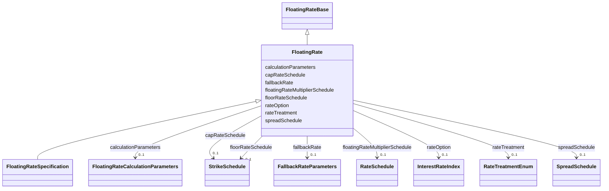

```mermaid
 classDiagram
    class FloatingRate
    click FloatingRate href "../FloatingRate"
      FloatingRateBase <|-- FloatingRate
        click FloatingRateBase href "../FloatingRateBase"
      

      FloatingRate <|-- FloatingRateSpecification
        click FloatingRateSpecification href "../FloatingRateSpecification"
      

      FloatingRate : calculationParameters
        
          
    
        
        
        FloatingRate --> "0..1" FloatingRateCalculationParameters : calculationParameters
        click FloatingRateCalculationParameters href "../FloatingRateCalculationParameters"
    

        
      FloatingRate : capRateSchedule
        
          
    
        
        
        FloatingRate --> "0..1" StrikeSchedule : capRateSchedule
        click StrikeSchedule href "../StrikeSchedule"
    

        
      FloatingRate : fallbackRate
        
          
    
        
        
        FloatingRate --> "0..1" FallbackRateParameters : fallbackRate
        click FallbackRateParameters href "../FallbackRateParameters"
    

        
      FloatingRate : floatingRateMultiplierSchedule
        
          
    
        
        
        FloatingRate --> "0..1" RateSchedule : floatingRateMultiplierSchedule
        click RateSchedule href "../RateSchedule"
    

        
      FloatingRate : floorRateSchedule
        
          
    
        
        
        FloatingRate --> "0..1" StrikeSchedule : floorRateSchedule
        click StrikeSchedule href "../StrikeSchedule"
    

        
      FloatingRate : rateOption
        
          
    
        
        
        FloatingRate --> "0..1" InterestRateIndex : rateOption
        click InterestRateIndex href "../InterestRateIndex"
    

        
      FloatingRate : rateTreatment
        
          
    
        
        
        FloatingRate --> "0..1" RateTreatmentEnum : rateTreatment
        click RateTreatmentEnum href "../RateTreatmentEnum"
    

        
      FloatingRate : spreadSchedule
        
          
    
        
        
        FloatingRate --> "0..1" SpreadSchedule : spreadSchedule
        click SpreadSchedule href "../SpreadSchedule"
    

        
      
```
