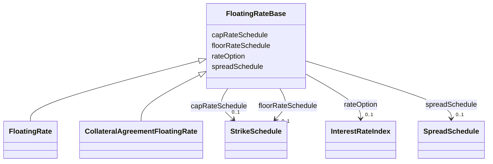

```mermaid
 classDiagram
    class FloatingRateBase
    click FloatingRateBase href "../FloatingRateBase"
      FloatingRateBase <|-- FloatingRate
        click FloatingRate href "../FloatingRate"
      FloatingRateBase <|-- CollateralAgreementFloatingRate
        click CollateralAgreementFloatingRate href "../CollateralAgreementFloatingRate"
      
      FloatingRateBase : capRateSchedule
        
          
    
        
        
        FloatingRateBase --> "0..1" StrikeSchedule : capRateSchedule
        click StrikeSchedule href "../StrikeSchedule"
    

        
      FloatingRateBase : floorRateSchedule
        
          
    
        
        
        FloatingRateBase --> "0..1" StrikeSchedule : floorRateSchedule
        click StrikeSchedule href "../StrikeSchedule"
    

        
      FloatingRateBase : rateOption
        
          
    
        
        
        FloatingRateBase --> "0..1" InterestRateIndex : rateOption
        click InterestRateIndex href "../InterestRateIndex"
    

        
      FloatingRateBase : spreadSchedule
        
          
    
        
        
        FloatingRateBase --> "0..1" SpreadSchedule : spreadSchedule
        click SpreadSchedule href "../SpreadSchedule"
    

        
      
```
