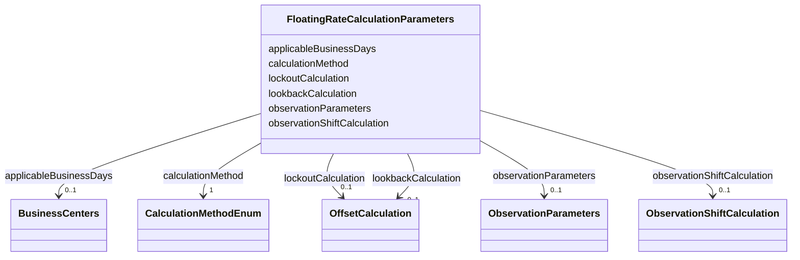

```mermaid
 classDiagram
    class FloatingRateCalculationParameters
    click FloatingRateCalculationParameters href "../FloatingRateCalculationParameters"
      FloatingRateCalculationParameters : applicableBusinessDays
        
          
    
        
        
        FloatingRateCalculationParameters --> "0..1" BusinessCenters : applicableBusinessDays
        click BusinessCenters href "../BusinessCenters"
    

        
      FloatingRateCalculationParameters : calculationMethod
        
          
    
        
        
        FloatingRateCalculationParameters --> "1" CalculationMethodEnum : calculationMethod
        click CalculationMethodEnum href "../CalculationMethodEnum"
    

        
      FloatingRateCalculationParameters : lockoutCalculation
        
          
    
        
        
        FloatingRateCalculationParameters --> "0..1" OffsetCalculation : lockoutCalculation
        click OffsetCalculation href "../OffsetCalculation"
    

        
      FloatingRateCalculationParameters : lookbackCalculation
        
          
    
        
        
        FloatingRateCalculationParameters --> "0..1" OffsetCalculation : lookbackCalculation
        click OffsetCalculation href "../OffsetCalculation"
    

        
      FloatingRateCalculationParameters : observationParameters
        
          
    
        
        
        FloatingRateCalculationParameters --> "0..1" ObservationParameters : observationParameters
        click ObservationParameters href "../ObservationParameters"
    

        
      FloatingRateCalculationParameters : observationShiftCalculation
        
          
    
        
        
        FloatingRateCalculationParameters --> "0..1" ObservationShiftCalculation : observationShiftCalculation
        click ObservationShiftCalculation href "../ObservationShiftCalculation"
    

        
      
```
