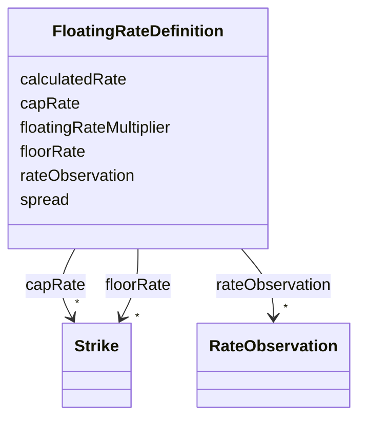

```mermaid
 classDiagram
    class FloatingRateDefinition
    click FloatingRateDefinition href "../FloatingRateDefinition"
      FloatingRateDefinition : calculatedRate
        
      FloatingRateDefinition : capRate
        
          
    
        
        
        FloatingRateDefinition --> "*" Strike : capRate
        click Strike href "../Strike"
    

        
      FloatingRateDefinition : floatingRateMultiplier
        
      FloatingRateDefinition : floorRate
        
          
    
        
        
        FloatingRateDefinition --> "*" Strike : floorRate
        click Strike href "../Strike"
    

        
      FloatingRateDefinition : rateObservation
        
          
    
        
        
        FloatingRateDefinition --> "*" RateObservation : rateObservation
        click RateObservation href "../RateObservation"
    

        
      FloatingRateDefinition : spread
        
      
```
