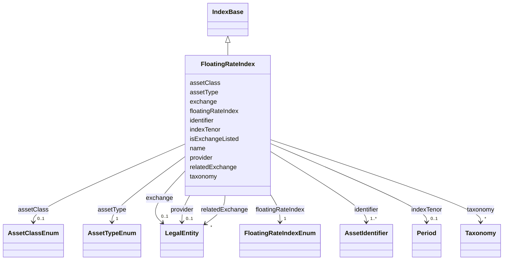

```mermaid
 classDiagram
    class FloatingRateIndex
    click FloatingRateIndex href "../FloatingRateIndex"
      IndexBase <|-- FloatingRateIndex
        click IndexBase href "../IndexBase"
      
      FloatingRateIndex : assetClass
        
          
    
        
        
        FloatingRateIndex --> "0..1" AssetClassEnum : assetClass
        click AssetClassEnum href "../AssetClassEnum"
    

        
      FloatingRateIndex : assetType
        
          
    
        
        
        FloatingRateIndex --> "1" AssetTypeEnum : assetType
        click AssetTypeEnum href "../AssetTypeEnum"
    

        
      FloatingRateIndex : exchange
        
          
    
        
        
        FloatingRateIndex --> "0..1" LegalEntity : exchange
        click LegalEntity href "../LegalEntity"
    

        
      FloatingRateIndex : floatingRateIndex
        
          
    
        
        
        FloatingRateIndex --> "1" FloatingRateIndexEnum : floatingRateIndex
        click FloatingRateIndexEnum href "../FloatingRateIndexEnum"
    

        
      FloatingRateIndex : identifier
        
          
    
        
        
        FloatingRateIndex --> "1..*" AssetIdentifier : identifier
        click AssetIdentifier href "../AssetIdentifier"
    

        
      FloatingRateIndex : indexTenor
        
          
    
        
        
        FloatingRateIndex --> "0..1" Period : indexTenor
        click Period href "../Period"
    

        
      FloatingRateIndex : isExchangeListed
        
      FloatingRateIndex : name
        
      FloatingRateIndex : provider
        
          
    
        
        
        FloatingRateIndex --> "0..1" LegalEntity : provider
        click LegalEntity href "../LegalEntity"
    

        
      FloatingRateIndex : relatedExchange
        
          
    
        
        
        FloatingRateIndex --> "*" LegalEntity : relatedExchange
        click LegalEntity href "../LegalEntity"
    

        
      FloatingRateIndex : taxonomy
        
          
    
        
        
        FloatingRateIndex --> "*" Taxonomy : taxonomy
        click Taxonomy href "../Taxonomy"
    

        
      
```
