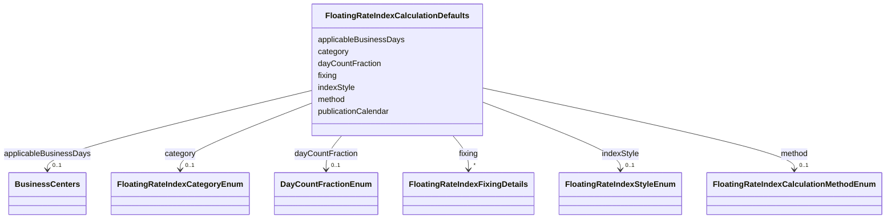

```mermaid
 classDiagram
    class FloatingRateIndexCalculationDefaults
    click FloatingRateIndexCalculationDefaults href "../FloatingRateIndexCalculationDefaults"
      FloatingRateIndexCalculationDefaults : applicableBusinessDays
        
          
    
        
        
        FloatingRateIndexCalculationDefaults --> "0..1" BusinessCenters : applicableBusinessDays
        click BusinessCenters href "../BusinessCenters"
    

        
      FloatingRateIndexCalculationDefaults : category
        
          
    
        
        
        FloatingRateIndexCalculationDefaults --> "0..1" FloatingRateIndexCategoryEnum : category
        click FloatingRateIndexCategoryEnum href "../FloatingRateIndexCategoryEnum"
    

        
      FloatingRateIndexCalculationDefaults : dayCountFraction
        
          
    
        
        
        FloatingRateIndexCalculationDefaults --> "0..1" DayCountFractionEnum : dayCountFraction
        click DayCountFractionEnum href "../DayCountFractionEnum"
    

        
      FloatingRateIndexCalculationDefaults : fixing
        
          
    
        
        
        FloatingRateIndexCalculationDefaults --> "*" FloatingRateIndexFixingDetails : fixing
        click FloatingRateIndexFixingDetails href "../FloatingRateIndexFixingDetails"
    

        
      FloatingRateIndexCalculationDefaults : indexStyle
        
          
    
        
        
        FloatingRateIndexCalculationDefaults --> "0..1" FloatingRateIndexStyleEnum : indexStyle
        click FloatingRateIndexStyleEnum href "../FloatingRateIndexStyleEnum"
    

        
      FloatingRateIndexCalculationDefaults : method
        
          
    
        
        
        FloatingRateIndexCalculationDefaults --> "0..1" FloatingRateIndexCalculationMethodEnum : method
        click FloatingRateIndexCalculationMethodEnum href "../FloatingRateIndexCalculationMethodEnum"
    

        
      FloatingRateIndexCalculationDefaults : publicationCalendar
        
      
```
