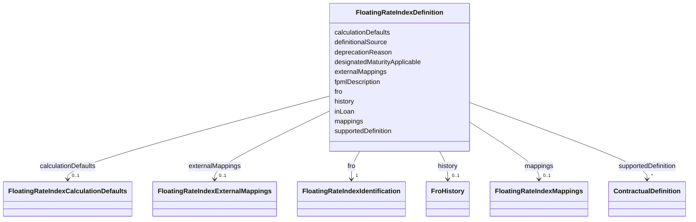

```mermaid
 classDiagram
    class FloatingRateIndexDefinition
    click FloatingRateIndexDefinition href "../FloatingRateIndexDefinition"
      FloatingRateIndexDefinition : calculationDefaults
        
          
    
        
        
        FloatingRateIndexDefinition --> "0..1" FloatingRateIndexCalculationDefaults : calculationDefaults
        click FloatingRateIndexCalculationDefaults href "../FloatingRateIndexCalculationDefaults"
    

        
      FloatingRateIndexDefinition : definitionalSource
        
      FloatingRateIndexDefinition : deprecationReason
        
      FloatingRateIndexDefinition : designatedMaturityApplicable
        
      FloatingRateIndexDefinition : externalMappings
        
          
    
        
        
        FloatingRateIndexDefinition --> "0..1" FloatingRateIndexExternalMappings : externalMappings
        click FloatingRateIndexExternalMappings href "../FloatingRateIndexExternalMappings"
    

        
      FloatingRateIndexDefinition : fpmlDescription
        
      FloatingRateIndexDefinition : fro
        
          
    
        
        
        FloatingRateIndexDefinition --> "1" FloatingRateIndexIdentification : fro
        click FloatingRateIndexIdentification href "../FloatingRateIndexIdentification"
    

        
      FloatingRateIndexDefinition : history
        
          
    
        
        
        FloatingRateIndexDefinition --> "0..1" FroHistory : history
        click FroHistory href "../FroHistory"
    

        
      FloatingRateIndexDefinition : inLoan
        
      FloatingRateIndexDefinition : mappings
        
          
    
        
        
        FloatingRateIndexDefinition --> "0..1" FloatingRateIndexMappings : mappings
        click FloatingRateIndexMappings href "../FloatingRateIndexMappings"
    

        
      FloatingRateIndexDefinition : supportedDefinition
        
          
    
        
        
        FloatingRateIndexDefinition --> "*" ContractualDefinition : supportedDefinition
        click ContractualDefinition href "../ContractualDefinition"
    

        
      
```
