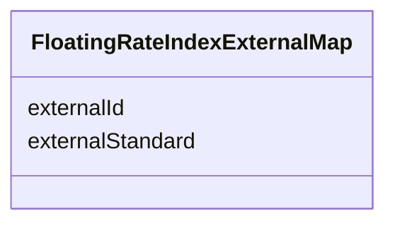

```mermaid
 classDiagram
    class FloatingRateIndexExternalMap
    click FloatingRateIndexExternalMap href "../FloatingRateIndexExternalMap"
      FloatingRateIndexExternalMap : externalId
        
      FloatingRateIndexExternalMap : externalStandard
        
      
```
