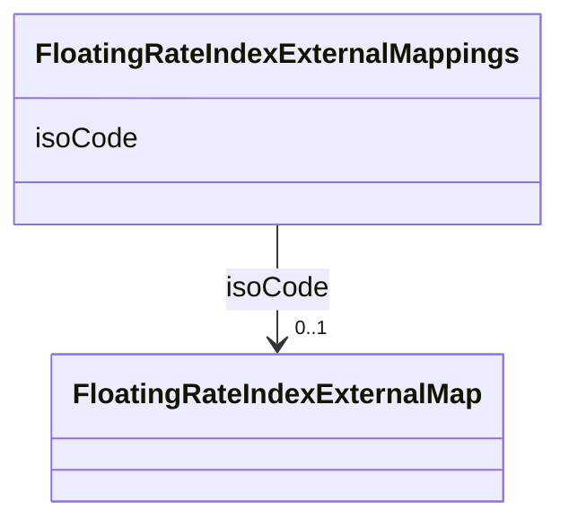

```mermaid
 classDiagram
    class FloatingRateIndexExternalMappings
    click FloatingRateIndexExternalMappings href "../FloatingRateIndexExternalMappings"
      FloatingRateIndexExternalMappings : isoCode
        
          
    
        
        
        FloatingRateIndexExternalMappings --> "0..1" FloatingRateIndexExternalMap : isoCode
        click FloatingRateIndexExternalMap href "../FloatingRateIndexExternalMap"
    

        
      
```
